<div align="center">

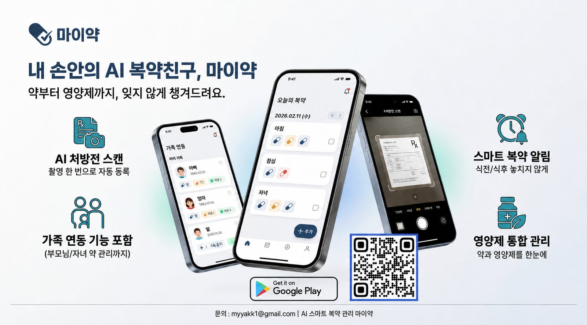

# 마이약 (MyYak)

**처방전을 찍으면 AI가 복약 정보를 자동 등록하고,<br/>복약 기록과 증상 메모를 분석해 숨은 건강 이상 신호까지 알려주는 AI 복약 관리 앱**

[](https://play.google.com/store/apps/details?id=com.myyak.app&hl=ko)


-61DAFB?style=flat-square&logo=react&logoColor=black)


**개인 프로젝트** · 2026.01 ~ 운영 중 · Google Play 정식 출시, 가입자 40+명 규모 운영

</div>

---

## 목차

1. [프로젝트 소개](#프로젝트-소개)
2. [주요 기능](#주요-기능)
3. [시스템 아키텍처](#시스템-아키텍처)
4. [기술적 도전과 해결](#기술적-도전과-해결)
5. [출시 및 운영](#출시-및-운영)
6. [앱 스크린샷](#앱-스크린샷)
7. [프로젝트 구성](#프로젝트-구성)

---

## 프로젝트 소개

고령화와 만성질환 증가로 여러 약을 장기간 복용하는 **다약제 복용자**가 늘고 있지만, 기존 복약 관리 서비스는 두 가지 한계가 있었습니다.

- **직접 입력과 단순 알림에 머물러** 디지털 취약 계층(어르신)이 접근하기 어렵고,
- 처방전 스캔도 **OCR + 정규식 파싱에 의존**해 병원·약국마다 다른 처방전/약봉투 양식에 대응하지 못했습니다.

마이약은 이 문제를 **LLM 기반 비정형 문서 이해**로 풀었습니다. 처방전을 촬영하면 AI가 복약 정보를 구조화해 알림까지 자동 등록하고, 쌓인 복약 기록과 증상 메모를 분석해 숨은 건강 이상 신호를 요약해 줍니다.

| 혼자 사는 청년의 영양제 관리 | 부모님 약을 챙기는 보호자 |
|:---:|:---:|
| 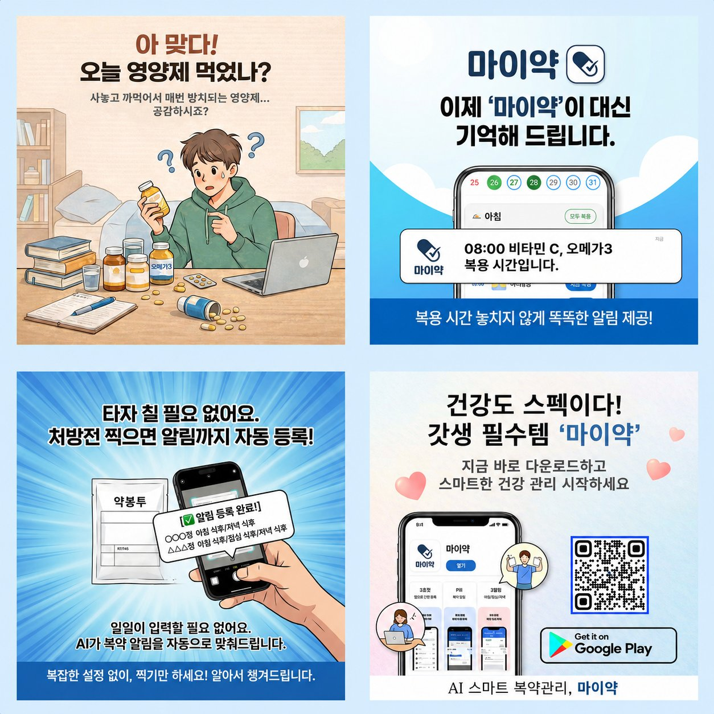 | 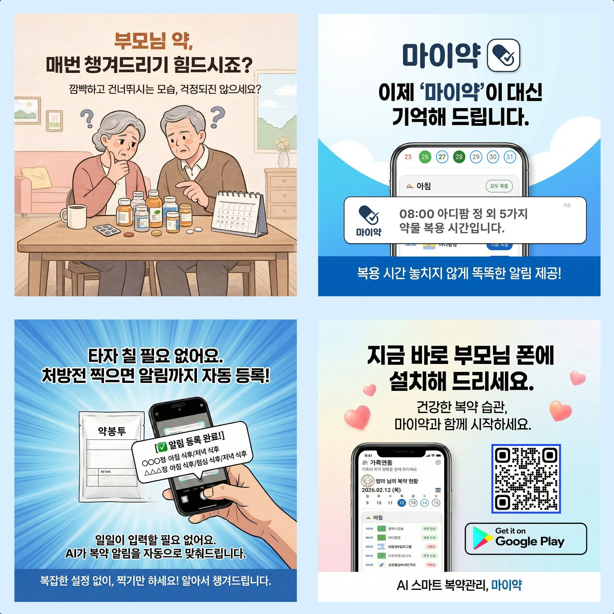 |

> 기획 단계에서 타겟 사용자를 "본인의 약/영양제를 관리하는 청년층"과 "부모님의 복약을 원격으로 챙기는 보호자"로 정의하고, 두 페르소나에 맞춰 **처방전 스캔 자동화**와 **가족 연동** 기능을 설계했습니다.

---

## 주요 기능

### 1. AI 처방전 스캔 — 촬영 한 번으로 복약 알림까지 자동 등록

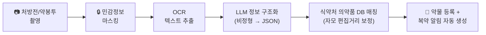
```mermaid
flowchart LR
    A["📷 처방전/약봉투<br/>촬영"] --> B["🔒 민감정보<br/>마스킹"]
    B --> C["OCR<br/>텍스트 추출"]
    C --> D["LLM 정보 구조화<br/>(비정형 → JSON)"]
    D --> E["식약처 의약품 DB 매칭<br/>(자모 편집거리 보정)"]
    E --> F["💊 약물 등록 +<br/>복약 알림 자동 생성"]
```

- 정규식 파싱으로는 불가능했던 **병원·약국마다 다른 양식**의 처방전/약봉투를 LLM이 구조화된 JSON으로 정규화
- OCR 오탈자를 **자모(초성·중성·종성) 편집 거리 알고리즘**으로 보정해 공공 의약품 DB와 매칭
- 인식된 용법(아침/점심/저녁, 식전/식후)에 맞춰 **푸시 알림까지 자동 등록**

### 2. 복약 푸시 알림 & 가족 연동

- Firebase FCM 기반 복용 시간 푸시 알림 (다시 알림 10/30/60분 지원)
- **가족 연동**: 연동된 보호자에게도 알림 제공, 부모님의 복약 현황을 원격으로 확인
- 복용/건너뛰기 기록이 월간 달력에 자동 집계

### 3. AI 건강 리포트 — 숨은 건강 이상 신호 탐지

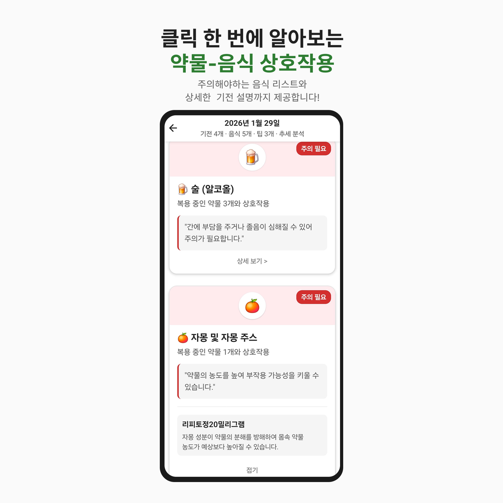

- 복용 중인 약물 목록 + 최근 30일 복약 기록 + 증상 메모를 LLM이 종합 분석
- **식약처 약물 상호작용 공공데이터**와 Few-shot 프롬프팅으로 숨은 질환 추론의 사고 과정을 유도
- 리포트 구성: 약물 기전 분석 · **약물-음식 상호작용** · 영양제 상호작용 · 생활 팁 · 복약 패턴 추세
- 술, 자몽 주스처럼 일상에서 마주치는 음식과 복용 약물의 상호작용을 근거(기전)와 함께 설명

<br clear="right"/>

### 4. 약물 검색 — 식약처 공공데이터 기반

- 식품의약품안전처 e약은요 API 기반 약물 정보 제공 (효능, 용법, 주의사항)
- 약물 데이터 **인메모리 캐싱(Caffeine)** 으로 타이핑 중 실시간 연관 검색어 노출

### 5. 관리자 페이지 — 직접 만든 운영 도구

- 클라우드 자원 및 가입자 현황 모니터링 대시보드
- **LLM 폴백 구조 + UI 조작만으로 운영 중 AI 모델 교체** 가능
- 에러 로그 대시보드 및 **대화형 AI 디버깅** (에러 로그를 LLM에게 분석 요청)

---

## 시스템 아키텍처

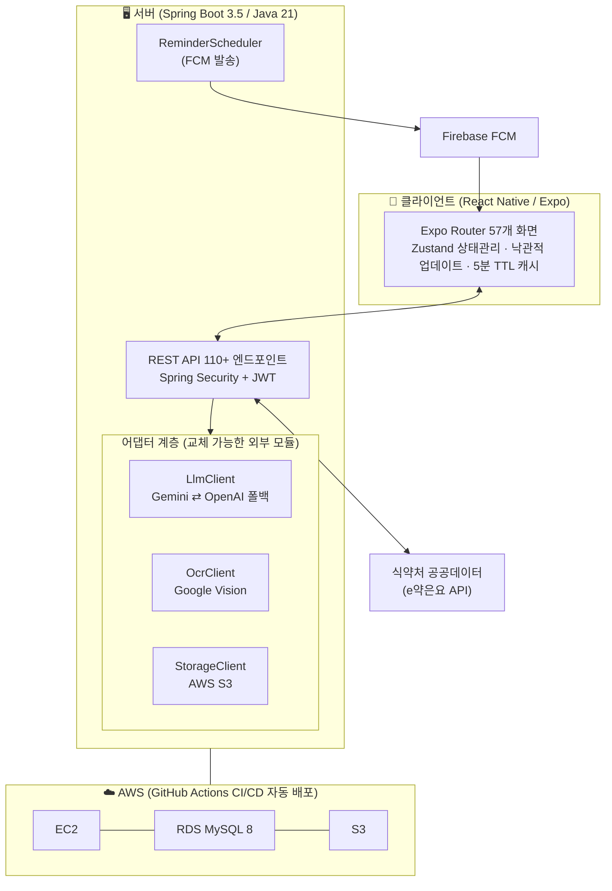
```mermaid
flowchart TB
    subgraph Client["📱 클라이언트 (React Native / Expo)"]
        APP["Expo Router 57개 화면<br/>Zustand 상태관리 · 낙관적 업데이트 · 5분 TTL 캐시"]
    end

    subgraph Server["🖥️ 서버 (Spring Boot 3.5 / Java 21)"]
        API["REST API 110+ 엔드포인트<br/>Spring Security + JWT"]
        SCHED["ReminderScheduler<br/>(FCM 발송)"]
        subgraph Adapter["어댑터 계층 (교체 가능한 외부 모듈)"]
            LLM["LlmClient<br/>Gemini ⇄ OpenAI 폴백"]
            OCR["OcrClient<br/>Google Vision"]
            STORAGE["StorageClient<br/>AWS S3"]
        end
    end

    subgraph Infra["☁️ AWS (GitHub Actions CI/CD 자동 배포)"]
        EC2["EC2"] --- RDS["RDS MySQL 8"] --- S3["S3"]
    end

    EXT["식약처 공공데이터<br/>(e약은요 API)"]
    FCM["Firebase FCM"]

    APP <--> API
    API --> Adapter
    SCHED --> FCM --> APP
    API <--> EXT
    Server --- Infra
```

### 기술 스택

| 영역 | 기술 |
|------|------|
| **Backend** | Spring Boot 3.5, Java 21, Spring Data JPA, Spring Security + JWT |
| **Client** | React Native (Expo SDK 54), TypeScript, Expo Router, Zustand, Axios |
| **Database** | MySQL 8 (AWS RDS), Caffeine (인메모리 캐시) |
| **AI** | Gemini API (기본) · OpenAI API (폴백), Google Vision OCR |
| **Infra** | AWS EC2 · S3, GitHub Actions CI/CD, EAS Build |
| **Push 알림** | Firebase Admin SDK (FCM) |

---

## 기술적 도전과 해결

### 1. 하나의 기능 안에서 AI 적용 구간을 분리해 비용·응답속도 최적화

처방전 스캔 전체를 고성능 LLM에 맡기면 비용과 지연이 커집니다. 파이프라인을 단계별로 쪼개 **OCR → 경량 모델(정보 구조화) → 알고리즘(DB 매칭)** 으로 역할을 나누고, 고성능 모델은 건강 리포트 분석처럼 추론이 필요한 구간에만 사용했습니다.

| 구간 | 처리 방식 | 이유 |
|------|-----------|------|
| 텍스트 추출 | OCR (Google Vision) | LLM 비전 대비 저비용·저지연 |
| 정보 구조화 | 경량 LLM (Gemini Flash 계열) | 단순 정규화 작업에 고성능 모델 불필요 |
| 약물명 매칭 | 자모 편집거리 알고리즘 | LLM 없이 OCR 오탈자 보정 가능 |
| 건강 리포트 | 고성능 LLM (Gemini Pro 계열) | 다단계 추론 필요 |

### 2. LLM API 장애 대응 — 어댑터 패턴 기반 폴백 구조

외부 LLM API는 언제든 장애·쿼터 초과가 발생할 수 있습니다. `LlmClient` 인터페이스 기반 **어댑터 패턴**으로 Gemini/OpenAI 구현체를 분리하고, 호출 실패 시 대체 제공자로 폴백합니다. 관리자 페이지에서 **재배포 없이 UI 조작만으로 운영 중 모델 교체**가 가능합니다.

```
LlmClient (interface)
├── GeminiClientAdapter   ← 기본
└── OpenAiClientAdapter   ← 폴백 / 운영 중 교체 가능
```

### 3. 신뢰할 수 있는 AI 응답을 위한 프롬프트 엔지니어링

의료 도메인 특성상 "그럴듯한 오답"이 치명적입니다. **Few-shot**(다양한 처방전 양식 예시 제공), **Chain-of-Thought**(숨은 질환 추론 시 사고 과정 유도), **Guardrail**(근거 없는 진단 차단, 응답 스키마 강제) 기법을 조합해 설명 가능하고 제한된 응답만 생성하도록 연구·테스트를 반복했습니다.

### 4. 민감 정보 보호

- 처방전 이미지의 개인정보는 LLM 전달 전 **마스킹 처리**
- email, 전화번호, FCM 토큰은 **AES 필드 레벨 암호화** (JPA Converter)
- 가족 연동용 전화번호는 **해시(검색용) + AES 암호화(저장용)** 이중 처리
- 모든 사용자 데이터 API에 **소유권 검증** 적용 (일괄 처리 API 포함)

### 5. 운영 환경 에러 대응 자동화

40여 명의 실사용자가 있는 서비스를 혼자 운영하기 위해 관리자 페이지에 **에러 로그 대시보드**를 만들고, 로그를 LLM에게 바로 분석 요청하는 **대화형 AI 디버깅** 기능을 붙여 장애 원인 파악 시간을 줄였습니다. 배포는 GitHub Actions CI/CD로 자동화해 main 머지 → EC2 배포 / Play Store 제출까지 사람 손을 거치지 않습니다.

---

## 출시 및 운영

- **Google Play 정식 출시** — [마이약: AI 처방약/영양제 알림, 건강상태 자동 분석](https://play.google.com/store/apps/details?id=com.myyak.app&hl=ko)
- 가입자 **40+명** 규모 실서비스 운영 중 (2026.01 ~ )
- 기획 → 디자인 → 개발 → 출시 → 운영/유지보수까지 **전 사이클 1인 수행**
- AI 도구(Claude Code, Codex)와 Figma를 결합한 개발 생산성 및 홍보물 제작 워크플로우 경험

---

## 앱 스크린샷

| 홈 — 오늘의 복약 | 처방전 스캔 | 약물 상세 |
|:---:|:---:|:---:|
| 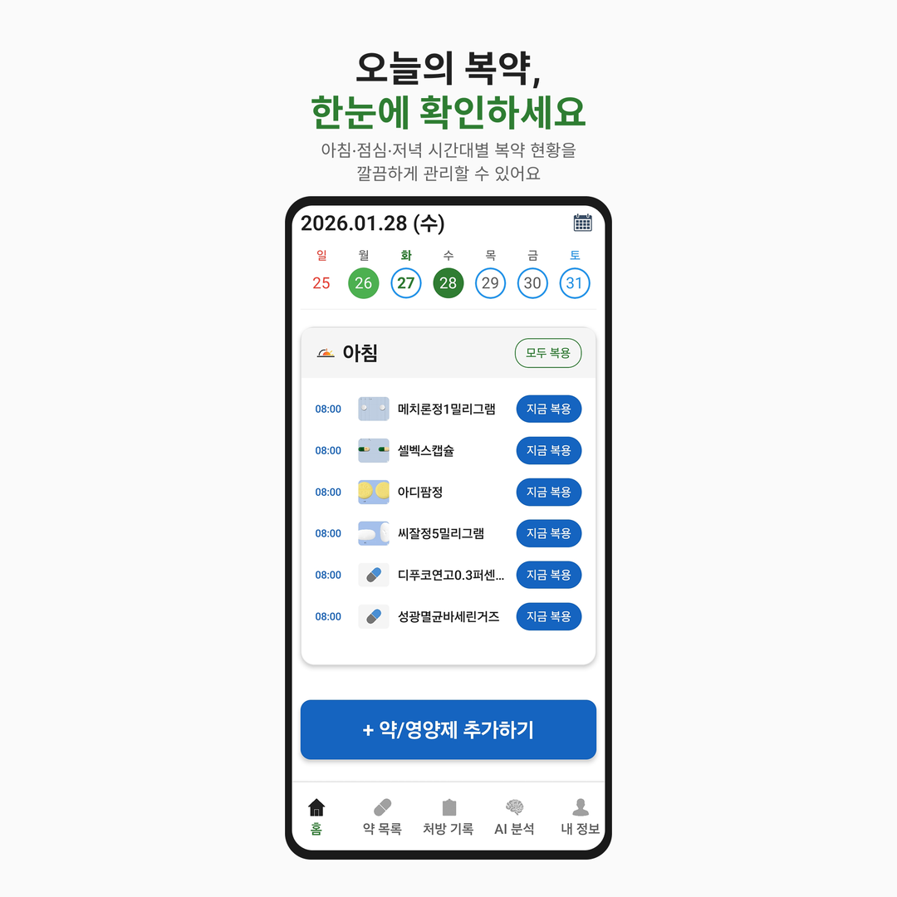 | 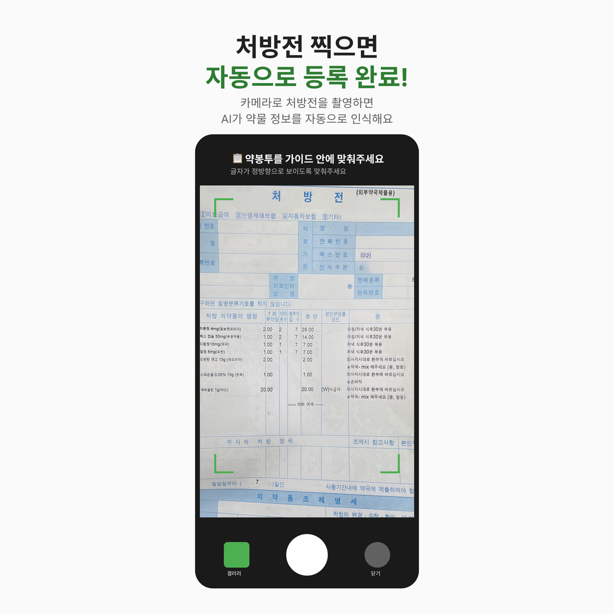 | 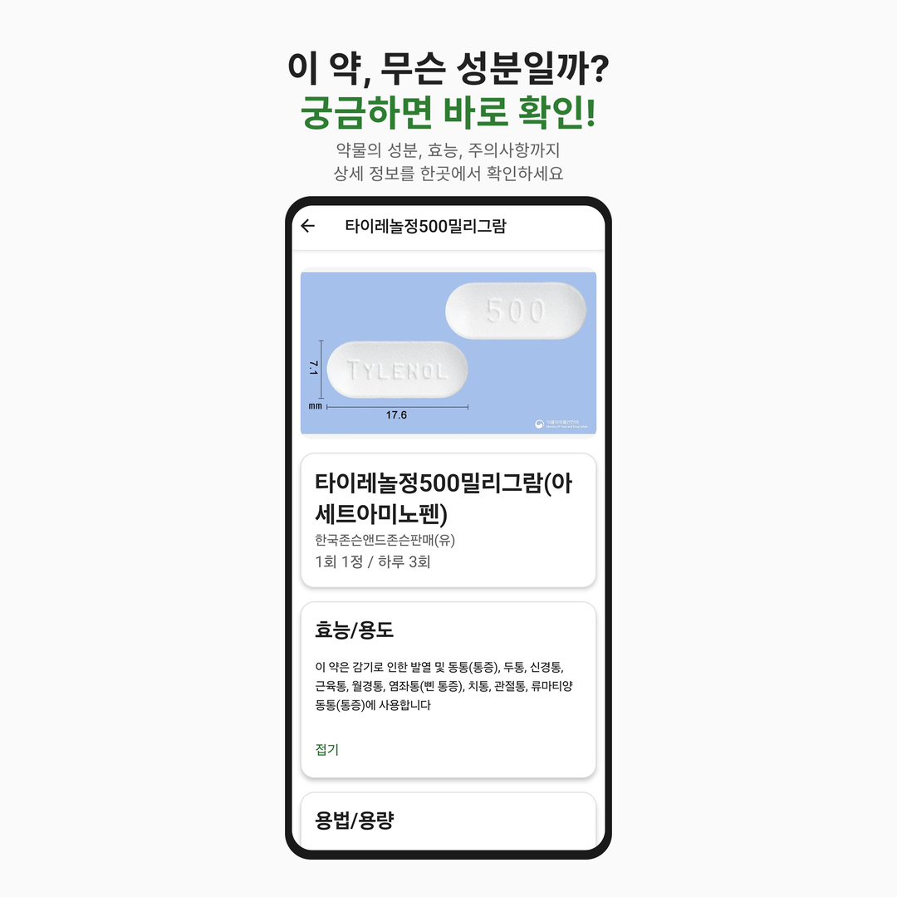 |

| AI 건강 리포트 — 요약 | AI 건강 리포트 — 추세 분석 |
|:---:|:---:|
| 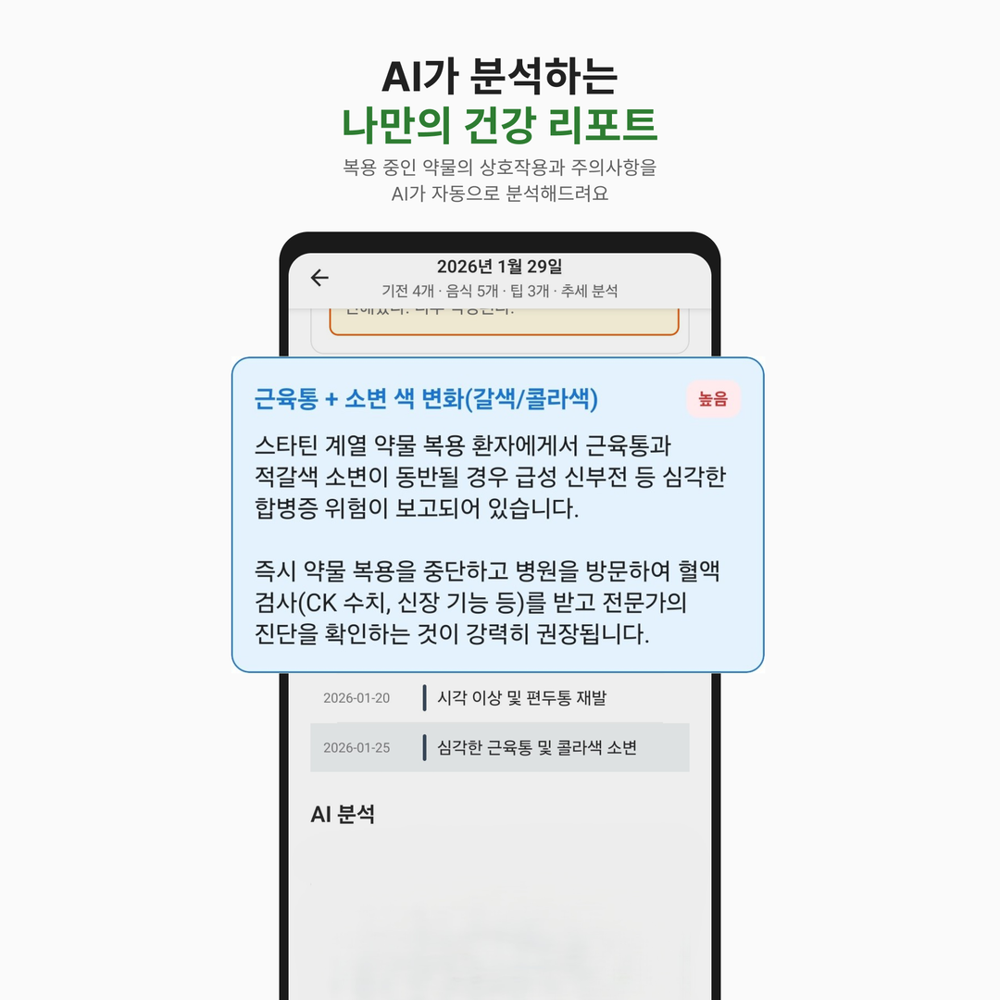 | 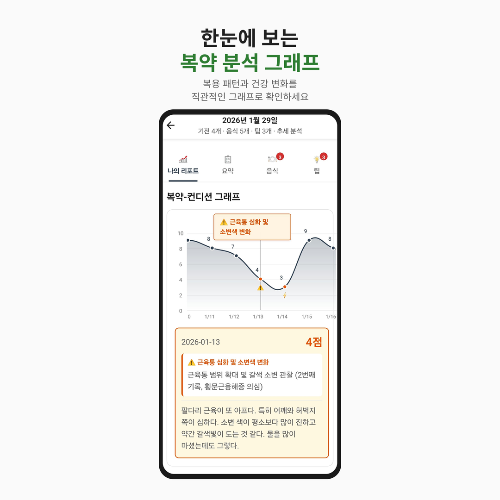 |

| 가족 연동 — 내 화면 | 가족 연동 — 가족 화면 |
|:---:|:---:|
| 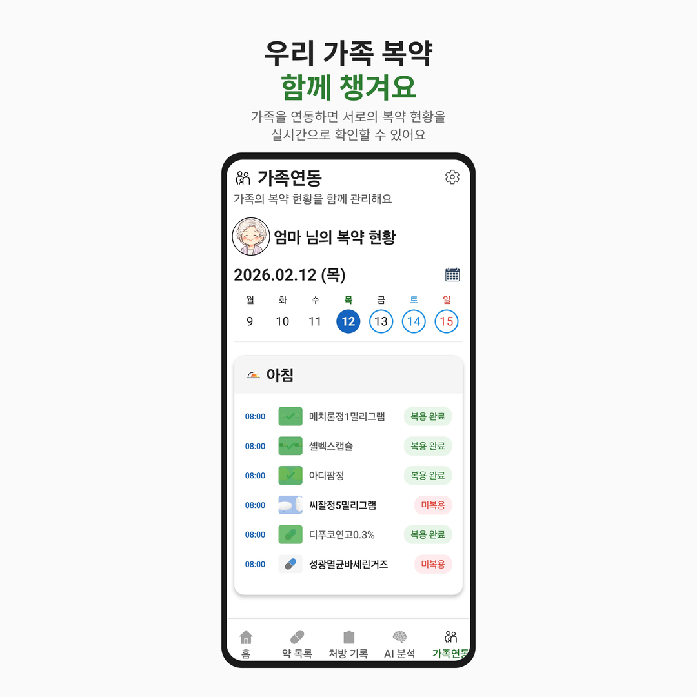 |  |

<div align="center">
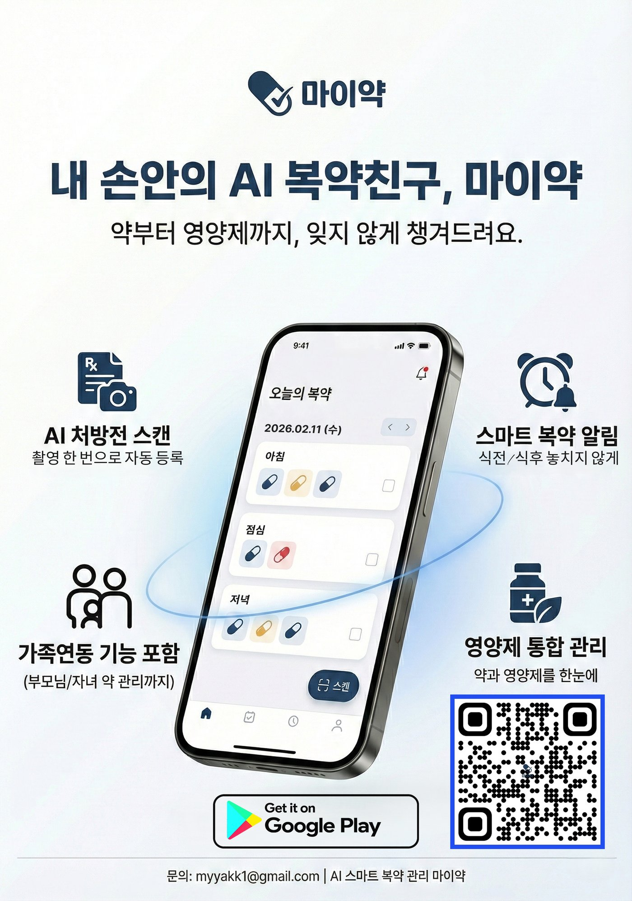

**지금 바로 사용해 보세요 →** [Google Play에서 다운로드](https://play.google.com/store/apps/details?id=com.myyak.app&hl=ko)
</div>

---

## 프로젝트 구성

| 리포지토리 | 설명 |
|-----------|------|
| [BackEnd-SpringBoot](https://github.com/myYack-team/BackEnd-SpringBoot) (현재 리포) | Spring Boot API 서버 — 22개 엔티티, 110+ REST 엔드포인트 |
| [Client-ReactNative](https://github.com/myYack-team/Client-ReactNative) | React Native (Expo) 모바일 앱 — 57개 화면, Zustand 스토어 6개 |

**백엔드 상세 문서**: 전체 API 명세, 엔티티 관계도, 폴더 구조는 [docs/BACKEND_GUIDE.md](docs/BACKEND_GUIDE.md) 참고

**문의**: myyakk1@gmail.com
